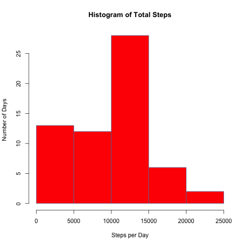
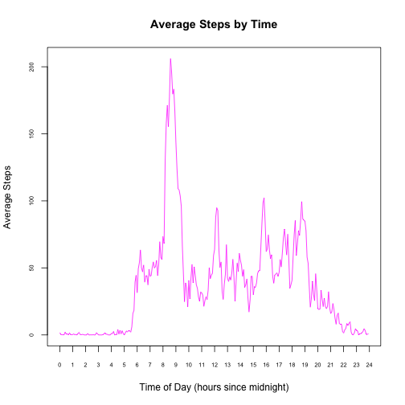
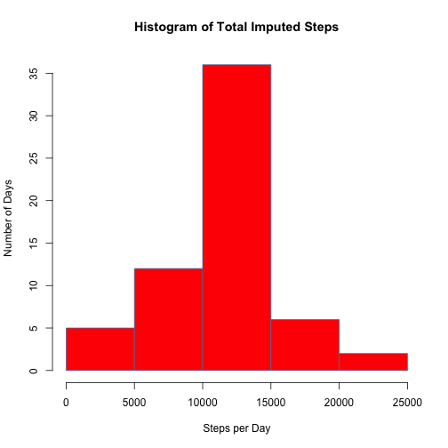
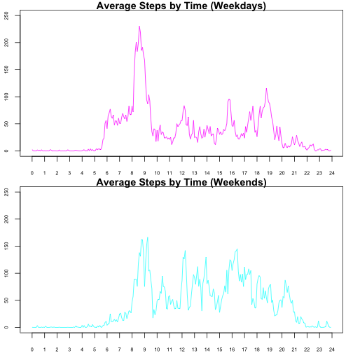

# Reproducible Research: Peer Assessment 1

---
 
Hello there!  Thanks for marking my reproducible research project. 
 
### Loading and preprocessing the data
 
The data can already be found in the repository, so code to download it isn't necessary.  Instead we're going to load up the dplyr package to aid manipulation, unzip and read the .csv file for the **act**ivity **mon**itoring **dat**a, turn the dates from factors into actual dates, and turn the intervals into hour multiples via a bit of simple arithmetic.
 
Note that we're also going to suppress warnings, otherwise the knitted document looks a lot less tidy.  We'll turn them back on at the end!
 

```r
options(warn=-1)
suppressMessages(library(dplyr))
 
unzip("./activity.zip")
act_mon_dat <- read.csv("./activity.csv")
act_mon_dat <- act_mon_dat %>% mutate(new_date = as.Date(date, format="%Y-%m-%d"),
                                      new_interval = floor(interval/100)+
                                        (interval/100-floor(interval/100))*100/60,
                                      date=NULL,interval=NULL) %>%
  select(new_date,steps,new_interval)
```
 
### What is the mean total number of steps taken per day?
 
The following code summarises the data by date, plots the appropriate histogram, and calculates two metrics (rounded for your convenience).
 

```r
total_steps <- act_mon_dat %>% group_by(new_date) %>% summarise(steps_total=sum(steps,na.rm=TRUE))
stepsplot<- with(total_steps,hist(steps_total,col="red",main="Histogram of Total Steps",
                      border="steelblue",xlab="Steps per Day",ylab="Number of Days"))
```



```r
mean_steps <- round(mean(total_steps$steps_total),0)
median_steps <- median(total_steps$steps_total)
```
 
The mean number of steps taken per day is 9354; and the median number is 10395.
 
### What is the average daily activity pattern?
 
The following code summarises the data by time interval instead, and plots the appropriate time series.
 

```r
time_series_data <- act_mon_dat %>%
  group_by(new_interval) %>% summarise(steps_mean=mean(steps,na.rm=TRUE))
stepsseries <- with(time_series_data,plot(new_interval,steps_mean,type="l",col="magenta",
                                          xaxp=c(0,24,24),cex.axis=0.6,
                                          main="Average Steps by Time",
                                          xlab="Time of Day (hours since midnight)",
                                          ylab="Average Steps"))
```


 
And now, some more numeric manipulation to output the time interval where the maximum number of steps takes place.  First we find the starting time of the interval where this maximum resides in the data; then we break it down into hours and minutes, and use these to derive the endpoint of the interval.
 

```r
max_steps <- as.numeric(time_series_data[which(
  time_series_data$steps_mean==max(time_series_data$steps_mean)),1][1,1])
max_steps_hour <- floor(max_steps)
max_steps_minutes <- as.numeric(round(max_steps*60-max_steps_hour*60,0),0)
max_steps_minutes_next <- as.numeric(max_steps_minutes+5)%%60
max_steps_hour_next<-ifelse(max_steps_minutes_next>max_steps_minutes, max_steps_hour,
                            max_steps_hour+1)
```
 
The maximum average number of steps takes place between 8:35 and 8:40.
 
### Imputing missing values
 
The number of missing values in the data is 2304.  To impute these, it seems like the average for that interval is more likely to be similar than the average for that day (especially at times when most of the dataset will be asleep).  Let's grab these from the time_series_data we created previously.
 
In the second part of the code we'll summarise the data and plot it, and calculate some metrics, as before.  (The options part of the code prevents unwanted scientific notation.)
 

```r
options(scipen=10)
 
impute_mon_dat <- merge(act_mon_dat,time_series_data)
impute_mon_dat <- impute_mon_dat %>%
  mutate(imputed_steps = ifelse(is.na(steps),steps_mean,steps),steps=NULL) %>%
  select(new_interval,new_date,imputed_steps)
 
total_imputed_steps <- impute_mon_dat %>% group_by(new_date) %>% summarise(imputed_steps_total=sum(imputed_steps,na.rm=TRUE))
 
imputestepsplot<- with(total_imputed_steps,hist(imputed_steps_total,col="red",
                                                main="Histogram of Total Imputed Steps",
                      border="steelblue",xlab="Steps per Day",ylab="Number of Days"))
```



```r
mean_imputed_steps <- round(mean(total_imputed_steps$imputed_steps_total),0)
median_imputed_steps <- round(median(total_imputed_steps$imputed_steps_total),0)
```
 
The mean number of steps taken per day changes to 10766; and the median number becomes 10766. 
 
The total imputed steps histogram is drawn towards the central bar (reallocation from the leftmost bar), and the averages are drawn upwards (to the same value).  This is because several days have their step counts for all times set to 'NA'.  These are replaced by 0 in the original analysis, and the mean step count for the other days in this analysis.
 
A better initial analysis might use act_mon_dat[which(!is.na(act_mon_dat$steps)),].
 
### Are there differences in activity patterns between weekdays and weekends?
 
We can split the imputed data into weekdays and weekends using the weekdays function in base R, and then subsetting the dataset based on that.  Then we transform into time series as done above.
 

```r
impute_mon_dat <- impute_mon_dat %>%
  mutate(isweekend = ifelse(as.character(weekdays(new_date,F))=="Saturday"|
                            as.character(weekdays(new_date,F))=="Sunday","Y","N"))
weekday_dat <- impute_mon_dat[which(impute_mon_dat$isweekend=="N"),]
weekend_dat <- impute_mon_dat[which(impute_mon_dat$isweekend=="Y"),]
time_series_week <- weekday_dat %>%
  group_by(new_interval) %>% summarise(steps_mean=mean(imputed_steps))
time_series_wkd <- weekend_dat %>%
  group_by(new_interval) %>% summarise(steps_mean=mean(imputed_steps))
```
 
Finally, we can plot these results!  Note the same axes being set for both, so that they can be compared.
 

```r
par(mfrow=c(2,1),mar=c(2,2,1,1))
with(time_series_week,plot(new_interval,steps_mean,type="l",col="magenta",
                           xaxp=c(0,24,24),cex.axis=0.6,
                           main="Average Steps by Time (Weekdays)",
                           xlab="Time of Day (hours since midnight)",
                           ylab="Average Steps",ylim=c(0,250)))
with(time_series_wkd,plot(new_interval,steps_mean,type="l",col="cyan",
                          xaxp=c(0,24,24),cex.axis=0.6,
                          main="Average Steps by Time (Weekends)",
                          xlab="Time of Day (hours since midnight)",
                          ylab="Average Steps",ylim=c(0,250)))
```


 
The differences are more or less what you'd expect: steps ramp up later and finish later, and are also more spread throughout the day on weekends.  Also, the number of steps involved in the commute to work (or morning gym session?) between 8 and 9 is much greater than any amount of walking done at weekends.  The end-of-day commute is possibly more spread out, so avoids this.

To finish off, as promised:


```r
options(warn=0)
```
 
---
 
Again, thank you very much for marking!
